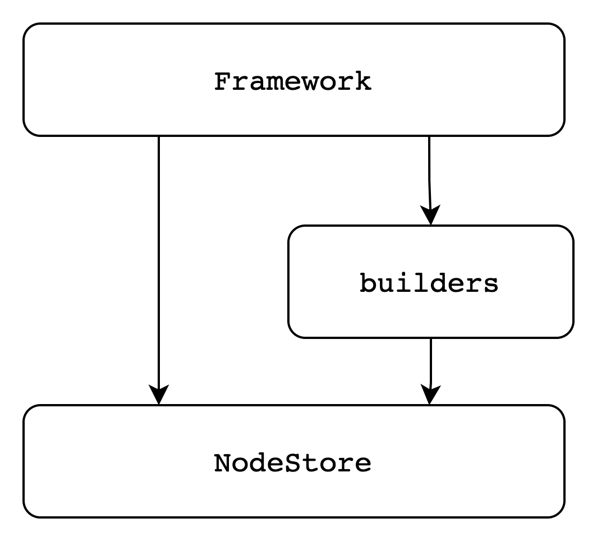
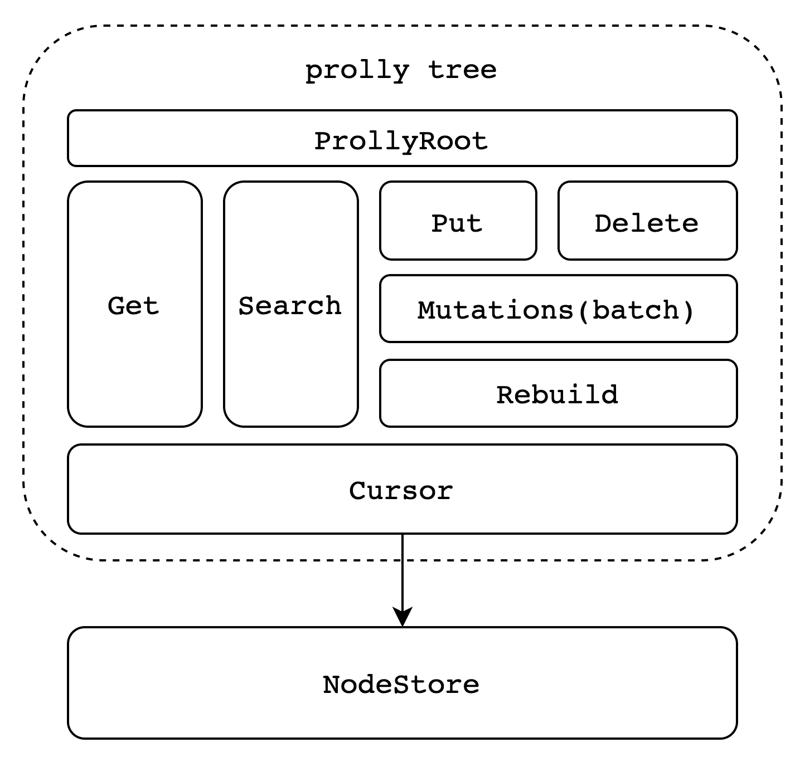
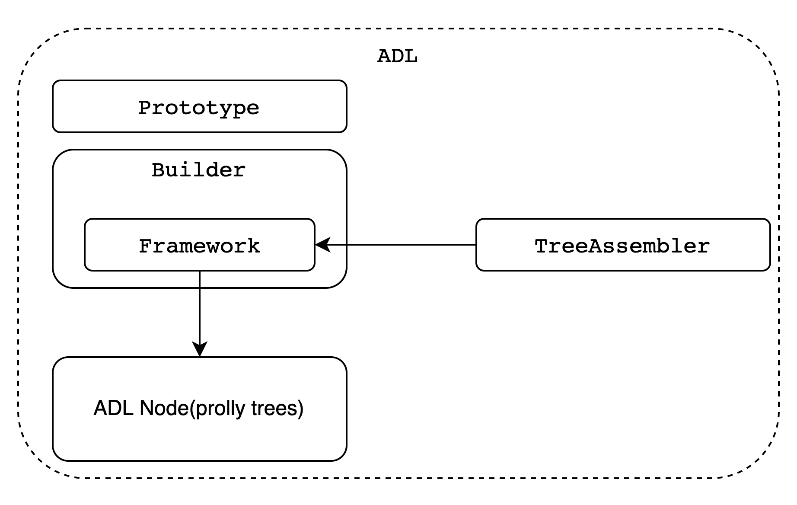

# go-ipld-prolly-trees
golang implementation of probabilistic merkle search trees for IPLD

## constructor
The prolly trees cannot be constructed in place; it needs a helper constructor, also know as `framework`.
```go
type Framework struct {
	done      bool
	cidPrefix *cid.Prefix
	nodeCoder *NodeCoder
	configCid cid.Cid
	builders  []*LevelBuilder
}
```


The structure is mainly composed of three layers：`Framework` -> `LevelBuilder` -> `NodeStore`.  The framework is responsible for the upper layer, the middle node layer is done by the builder, and all data is stored in the nodestore abstraction..

## prolly tree
Once the prolly tree has been constructed, only the root (entry) node of the prolly trees is needed for query operations.
```go
type ProllyTree struct {
	ProllyRoot
	root       ProllyNode
	Ns         NodeStore
	treeConfig TreeConfig

	mutating  bool
	mutations *Mutations
}
```

If update operations (add/delete) are needed, they need to be done through the constructor.

```go
// TreeConfig includes config for prolly tree, it includes some global setting, the splitter method you choose and specific configs about
// the splitter
type TreeConfig struct {
	StrategyType   byte
	MinNodeSize    int
	MaxNodeSize    int
	MaxPairsInNode int
	NodeCodec      []byte
	Strategy       strategy
}
```

```go
const (
	SuffixThreshold  = 0
	WeibullThreshold = 1
	RollingHash      = 2
)
```

* ProllyNode：It's the same from the leaf to the root
* ProllyRoot：include
  - CID of the Root ProllyNode
  - CID of a configuration node

```go
const (
	Unknown op = 0
	Modify  op = 1
	Add     op = 2
	Remove  op = 3
)
```
## ADL
