# IPLD Prolly Tree Spec
## Summary
IPLD Prolly Tree is a index module that is based on the ProllyTree and IPLD. It uses the ProllyTree algorithm(combination of B-Tree and Merkle Tree) but the storage and tree nodes are implemented using the IPLD suite of tools and specifications. IPLD ProllyTrees have advantages from both IPLD and ProllyTree such as supporting any IPLD node for values, deduplication, reducing the number of changed nodes when updating a tree, and more. It can be used as a database index similar to Dolt (via our IPLD-Prolly-Indexer library), or used as an ADL. It’s powerful in some fields like fact diff, version control, It works really well for storing structured data with git-like semantics.

## ProllyTree and IPLD
### Prolly-trees
A Prolly-tree is a little like a complete B-tree, but blended with ideas that come from storage algorithms for file sharing and distributed version control systems. A Prolly-tree stores all key-value data in leaf nodes, exactly like a B-tree, and internal nodes with key delimiters and children pointers, exactly like a B-tree. But both the leaf nodes and the internal nodes are variable-length and content-addressed. The children pointers within the internal nodes are the content addresses of the leaf or internal blocks that they point to.
The trick is to pick block boundaries that give us lots of structural sharing. Intuitively, if we have a map<Date, Float> of all the temperatures in Los Angeles for the months of Jan, Feb, April, and May of the year 2019, we want almost no blocks to change when we do any of the following:
- Insert all temperatures for the year 2018.
- Insert all temperatures for the remainder of the year 2019.
- Insert the missing temperatures for March, 2019.

In order to accomplish that, we can't just use fixed-size blocks and build up a complete content-addressed B-tree with the set of data that we have. Inserting data into one block in the middle of the tree will cause a cascading effect that causes every block that comes after that block to change as well. And that change will ripple up the internal nodes of the tree.
Instead, block boundaries for leaves and internal nodes alike are chosen probabilistically by a rolling hash of the contents of the node itself. The contents of the node are fed to a rolling hash and if the hash value falls below a chosen threshold, a block boundary is formed and a new block is started. The threshold probability for creating a block boundary is set to generate an average desired block size, currently 4KB. But any particular block could be quite small or quite large. The B-tree from above might look like this as a Prolly-tree:

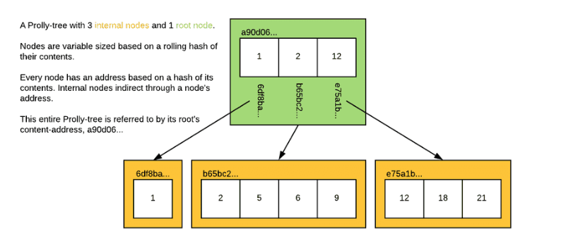

The effect is that the blocks generated by a local mutation to the tree have a very high probability of synchronizing back up with the blocks from the unmutated tree. As soon as the blocks at one layer of the tree are synchronized, the next layer of internal nodes are likely to synchronize as well. In practice, the rolling window can be quite small and many small mutations do not affect chunk boundaries at all. This means that the tree can achieve close to the optimal copy-on-write performance of just replacing the single leaf and the internal nodes that appear on the spline from the leaf to the root internal node of the Prolly-tree.
Naively Building a Prolly-tree
Perhaps the easiest way to conceptualize the end result of building a prolly tree is to think about a process to build it from the bottom up. Imagine you have all the <byte[], byte[]> pairs you want to store in a Prolly-tree.
1. Sort them all by their key value, so that they're laid out in order and place them one after another into a single byte[]. For the tree above, we would have:

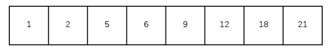

2. Group the resulting byte stream into blocks by running a rolling hash over its contents. Anytime the hash value is below a target value, form a block boundary as soon as you are at the end of a value and start a new block. Here's the blocking step on our leaf nodes:

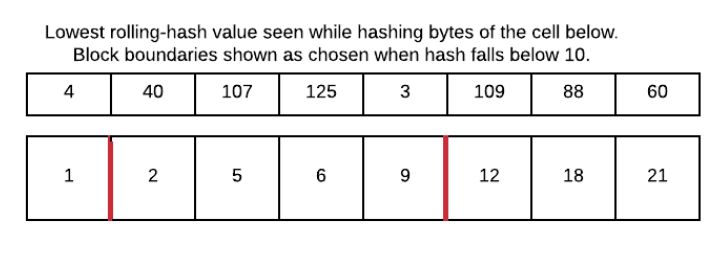

3. You now have a list<byte[]> of the leaf nodes of your Prolly-tree. You can compute the content address of each block by applying a strong hash function to its contents. You can store the contents in a content-addressable block store, retrievable at ADDR. Here our blocks have been addressed and stored in the block store:

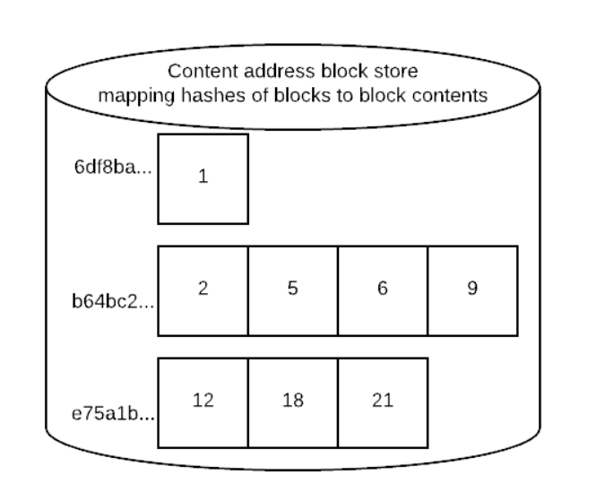

4. If the length of this list is 1, then you are done. The content-address of your table is the ADDR of the one block in the list.

5. Otherwise, form the next layer of your prolly tree by creating a byte stream that stores <byte[], ADDR> of every entry in the leaf node list, where byte[] is the value of the key in the first entry of the block. Here's what the entries for the first internal level of the tree would look like for our example:

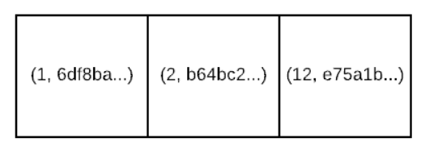

If you place those pairs one after another into a single byte[], you now have a byte stream that can to be turned into content-address blocks to form a layer of internal blocks of your Prolly-tree. To do so, goto step #2. The algorithm terminates when step #4's condition is reached.
### Properties of the Prolly-tree
So what can we do with the Prolly-tree given the content addressing and structural sharing?
- The Prolly-tree for a map<byte[], byte[]> value forms a merkle tree. We can verify the content addresses of every block, and we have efficient structural sharing without trust issues regarding the contents of the block data itself.
- We have efficient recursive diff between two values. If the content address of two nodes are different, then at least some of the values in the children of that node are different. By comparing content addresses at every layer of the tree, you can quickly walk to just the parts that are different.
- Similarly, we have an efficient way to synchronize the missing parts of a tree to another repository — as you walk the chunks you need to transit, if you encounter a chunk that is already present in the destination, you don't need to check for the presence of any of its children.

While the Prolly-tree gives us a lot of nice things, this structure isn't without tradeoffs. Here are some:
- Variable length blocks are typically not as efficient as an optimally sized fixed-size block for I/O subsystems, allocators, etc.
- While small changes to a block often don't affect block boundaries, they do change existing boundaries sometimes. ProllyTree necessarily writes more blocks than even a copy-on-write B-tree implementation.
- Going through a content-address for internal node pointers means going through another index to find the actual block data. We can't embed pointers in internal nodes within node store that allow a direct I/O for the next needed piece of data. While indexes for locating blocks by their addresses can be made quite fast, they're never as fast as having a file offset to a fixed size block directly in hand after reading the internal node, for example.
### IPLD
IPLD is the data model of the content-addressable web. It allows us to treat all hash-linked data structures as subsets of a unified information space, unifying all data models that link data with hashes as instances of IPLD. In the project(IPLD ProllyTree) we use [IPLD node](https://ipld.io/docs/data-model/node/)(bindnode), [IPLD schema](https://ipld.io/docs/schemas/) and [IPLD ADL](https://ipld.io/docs/advanced-data-layouts/)(Advanced Data Layouts)

## Architecture

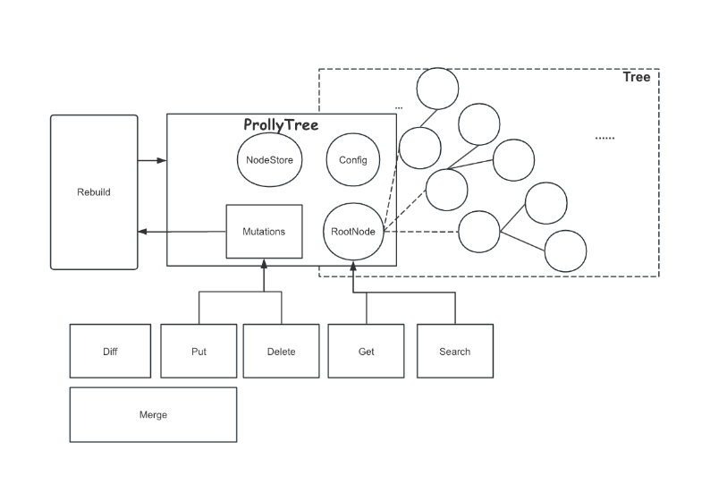

Core structure of (IPLD)ProllyTree is the ProllyTree.It includes the vital fields and api to use such as Get, Search, Delete…Some of them don’t update the tree, but some will do that and rebuild the tree. ProllyTree does not store the total tree in the structure, it only saves the root node.Reading the relative tree path from nodestore while some traversal action is happening

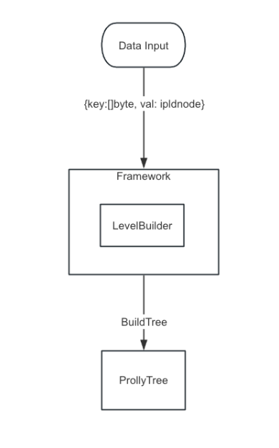

Framework is used for tree building. We input sorted data into the framework then call the BuildTree to get a new ProllyTree from the data.The tree is built level by level(bottom) by LevelBuilders. Leaf nodes are linked by parent nodes by the cid link(IPLD node). All nodes are saved in NodeStore referenced by cid.

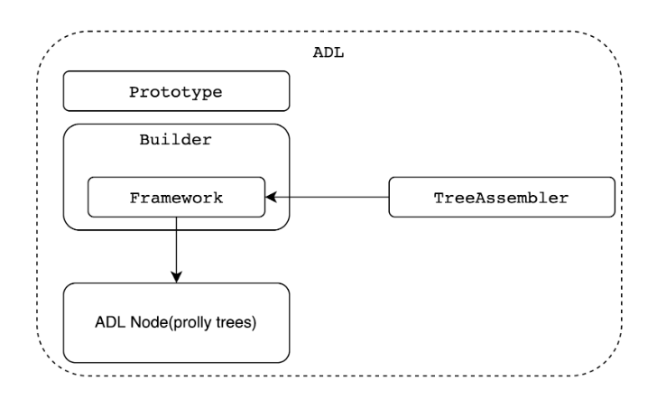

IPLD ProllyTree implemented the IPLD ADL(Advanced Layout) interface based on above structures.It includes ProllyTreeADLPrototype, Builder, TreeAssembler(MapAssembler) and ADL Node. It helps people who want to build large map(dict) by ProllyTree with ADL in IPLD world.

## Modules
### Storge(NodeStore)

```golang
type NodeStore interface {
	WriteNode(ctx context.Context, nd *ProllyNode, prefix *cid.Prefix) (cid.Cid, error)
	ReadNode(ctx context.Context, c cid.Cid) (*ProllyNode, error)

	WriteTree(ctx context.Context, tree *ProllyTree, prefix *cid.Prefix) (cid.Cid, error)
	ReadTree(ctx context.Context, c cid.Cid) (*ProllyTree, error)

	WriteTreeConfig(ctx context.Context, cfg *TreeConfig, prefix *cid.Prefix) (cid.Cid, error)
	ReadTreeConfig(ctx context.Context, c cid.Cid) (*TreeConfig, error)

	WriteProof(ctx context.Context, prf Proof, prefix *cid.Prefix) (cid.Cid, error)
	ReadProof(ctx context.Context, c cid.Cid) (Proof, error)

	LinkSystem() *ipld.LinkSystem

	Close()
}
```

NodeStore is an important module that saves almost all information and data of ProllyTree. It is used anywhere in the project such as tree building, updating, getting, etc. It can also read previously saved tree nodes. The nodestore we use in the project is based on the IPFS blockstore interface.
### ProllyTree
```golang
type ProllyTree struct {
ProllyRoot
root       ProllyNode
ns         NodeStore
treeConfig TreeConfig
treeCid    *cid.Cid

mutating  bool
mutations *Mutations
}
```
ProllyTree is the core part in the project, it provides api for people to use the tree, it can also play the role as a package like in ADL, IPLD-Prolly-Indexer. The root node(ProllyNode) is the entry of the tree. When we need traverse the tree or some branch path in tree, we read the cidlink in node value and get relative node from NodeStore by cid.TreeConfig contains important information about the prollytree such as node size limit, hash function, cid version, codec and so on.It is set while building from framework.Mutations is used for tree mutating(updating), we won’t update for every mutating action such as putting(includes inserting and modifying), deleting.Mutations caches these actions then apply them while Rebuilding is called.

### ProllyNode
```golang
type ProllyNode struct {
IsLeaf       bool
Keys         [][]byte
Values       []ipld.Node
SubtreeCount []uint32
}
```
ProllyNode is the base role in ProllyTree, it includes key/value pairs and total subtree count(how many raw key/value pairs in the subtree).IsLeaf means whether the node is a leaf node.Root ProllyNode is saved in ProllyTree as entry for travel.

### IPLD schema of ProllyNode
```txt
type ProllyNode struct {
# true for leaf nodes and false for branch nodes
isLeaf Bool
# raw keys(input from users) for leaf node. For branch node, the key is last key in the child node
keys [Bytes]
# input data from users for leaf nodes, link(cid) for branch nodes
values [Any]
subtreeCount [Int]
} representation tuple
```

### Framework
```golang
type Framework struct {
done      bool
cidPrefix *cid.Prefix
nodeCoder *NodeCoder
configCid cid.Cid
builders  []*LevelBuilder
}
```
Framework is used while tree building or rebuilding(updating), it received raw data(sorted k/v pairs) and generates tree nodes and links them. It also contains some meta information about the tree building such as tree config(cid), cid prefix(standard of the cid saved in ProllyNode values). Builders are used to build the ProllyTree level by level.NodeCoder is to limit the generated Node size(tree config limits the node content size)

### Splitter
```golang
type Splitter interface {
// IsBoundary returns whether boundary generated at current location
IsBoundary() bool
Append(key, val []byte) error
Reset()
}
```
Whether a boundary generated is determined by the Splitter. It’s initialized with the hash function and some node config such as NodeMaxSize, NodeMinSize, MaxPairsInNode and so on.Splitter received every k/v pair and put into the computation to judge whether meet the condition to generate new ProllyNode, it resets after new ProllyNode generated.

### TreeConfig
```golang
type TreeConfig struct {
MinNodeSize    int
MaxNodeSize    int
MaxPairsInNode int
CidVersion     uint64
Codec          uint64
HashFunction   uint64
HashLength     *int
//NodeCodec      NodeCodec
StrategyType byte
Strategy     strategy
}
```

### StrategyType
The enum for the types of chunking strategies that are part of the spec. This is set to be a byte so that the number of strategies can grow over time.

### Strategy
Chunk Config for prolly tree, it includes some global setting, the splitter method you choose and specific configs about the splitter

### MinNodeSize
The minimum size a chunk should be before considering the boundry function.

### MaxNodeSize
The maximum size a chunk could be before it needs to be split regardless of the chunk boundaries

### PrefixThresholdConfig
Config for the PrefixThreshold chunking strategy.
This is the original strategy that was described in the Merkle Search Tree paper and has a chunkingFactor which represents the number of bits in the key which need to be 0 in order to set another boundry.
Lower values result in wider nodes.

### WeibullThresholdConfig
Config for the WeiBullThreshold chunking strategy.
Makes chunk boundary decisions on the hash of the key of a []byte pair and tries to create chunks that have an average number of []byte pairs, rather than an average number of Bytes. However, because the target number of []byte pairs is computed directly from the chunk size and count, the practical difference in the distribution of chunk sizes is minimal. It uses a dynamic threshold modeled on a weibull distribution (https://en.wikipedia.org/wiki/Weibull_distribution). As the size of the current trunk increases, it becomes easier to pass the threshold, reducing the likelihood of forming very large or very small chunks.
The K value represents the Shape Parameter, and L represents λ - the scaling factor.

### RollingHashConfig
rollingHashSplitter is a nodeSplitter that makes chunk boundary decisions using a rolling value hasher that processes Item pairs in a byte-wise fashion.
rollingHashSplitter uses a dynamic hash pattern designed to constrain the chunk Size distribution by reducing the likelihood of forming very large or very small chunks. As the Size of the current chunk grows, rollingHashSplitter changes the target pattern to make it easier to match. The result is a chunk Size distribution that is closer to a binomial distribution, rather than geometric.

### Cursor
```golang
type Cursor struct {
node   *ProllyNode
idx    int
ns     NodeStore
parent *Cursor
}
```
Cursor is very important and it is used in most ProllyTree api, it’s similar to the traditional database cursor. Whatever find a pair by the key or rebuild the ProllyTree, it is a must to locate the element we want, when we find a key in a node it is using the binary search in fact.

## API
### `func (pt *ProllyTree) Get(key []byte) (ipld.Node, error)`
Get the value(IPLD node) by the key from the ProllyTree

### `func (pt *ProllyTree) GetProof(key []byte) (Proof, error)`
Get the proof(merkle path) of the pair by the key

### `func (pt *ProllyTree) Search(ctx context.Context, start []byte, end []byte) (*Iterator, error)`
Range search, input the start and end key(keys order is decided by the default bytes compare) then return the iterator, read the result by Next() or NextPair() like the channel, if arrive the end, the io.EOF error will be returned

### `func (pt *ProllyTree) Put(ctx context.Context, key []byte, val ipld.Node) error`
Put a pair into the ProllyTree(cached in mutations), if the key has existed, its val will be replaced, if not we add the new pair.

### `func (pt *ProllyTree) Delete(ctx context.Context, key []byte) error`
Delete the pair by the key(cached in mutations), if the key not existed, won’t return the error

### `func (pt *ProllyTree) Diff(other *ProllyTree) (*Diffs, error)`
Compare two ProllyTrees then return the diffs from smallest different key/val pair, but we ignore the deleted pairs in the other ProllyTree. i.e. The pairs existed in original ProllyTree but not in other won’t be returned in Diffs, only new or modified pairs are returned. In addition, we skip most common part by comparing the cid of node.

### `func (pt *ProllyTree) Merge(ctx context.Context, other *ProllyTree) error`
Merge two ProllyTrees and modify the original ProllyTree as result, this function will call Diff then apply the mutations from Diff, so in fact we get the new pairs(not existed in original tree) and modified pairs(key is the same but val differ) and apply them in the original ProllyTree, the other ProllyTree is not changed.

## Algorithm and Workflow
If we want to insert k8:v8(bigger number means the key is bigger(default bytes compare)) to a ProllyTree

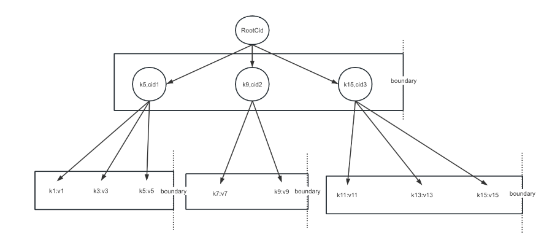

Step1.
1. find the smallest element bigger than or equal with the inserted element and processPrefix(), add elements into chunker builder recursively until top chunker
2. append the inserted element to builder
3. append all elements from the cursor to end until meet the same boundary with old nodes or arrived the end of this level

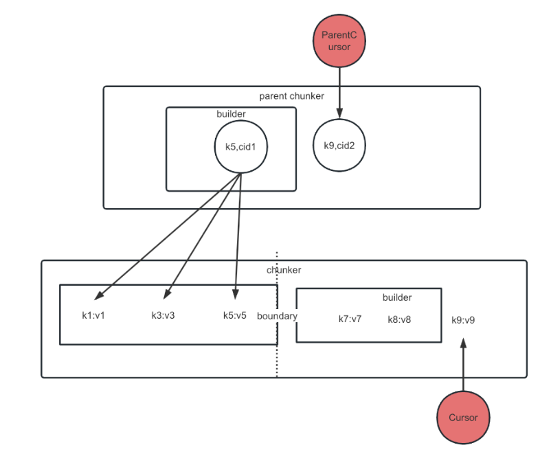

Step2.
1. generate the same boundary(assume) with old nodes, break cursor moving and appending elements.
2. Advance the parent cursor

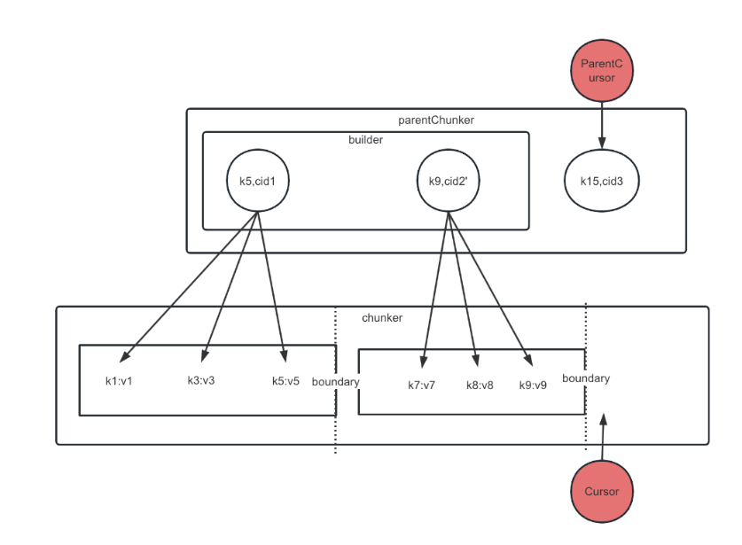

Step3.

Recursively build, skip struct shared nodes, get the new root node

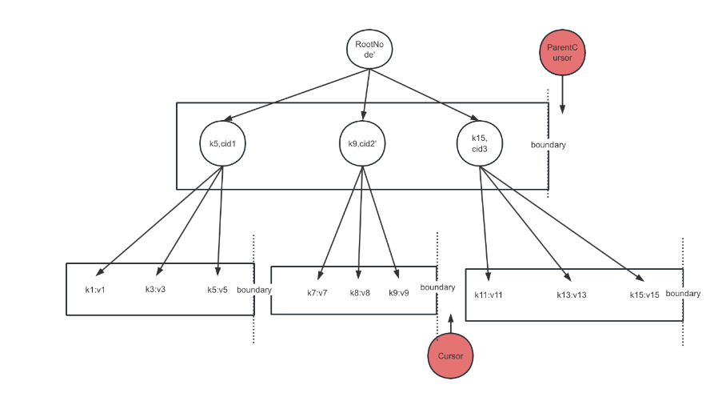


## Reference
### DoltDB

https://github.com/dolthub/docs/tree/gitbook-publish/content/architecture  

The best deep dive into how the Dolt storage engine works is a series of blog posts by Aaron Son.

### How Dolt Stores Table Data  
https://www.dolthub.com/blog/2020-04-01-how-dolt-stores-table-data/

### The Dolt Commit Graph and Structural Sharing  
https://www.dolthub.com/blog/2020-05-13-dolt-commit-graph-and-structural-sharing/

### Efficient Diff on Prolly Trees  
https://www.dolthub.com/blog/2020-06-16-efficient-diff-on-prolly-trees/

### Cell-level Three-way Merge in Dolt  
https://www.dolthub.com/blog/2020-07-15-three-way-merge/

### Dolt Implementation Notes — Push And Pull On a Merkle DAG  
https://www.dolthub.com/blog/2020-09-09-push-pull-on-a-merkle-dag/
