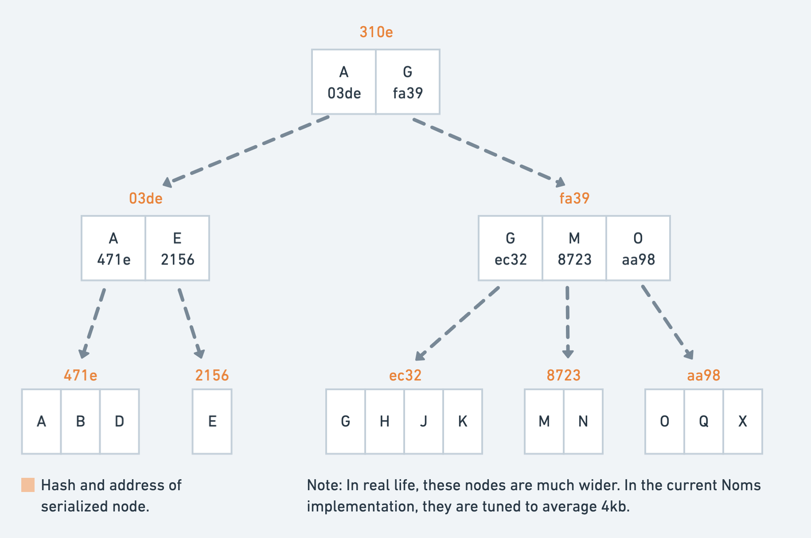
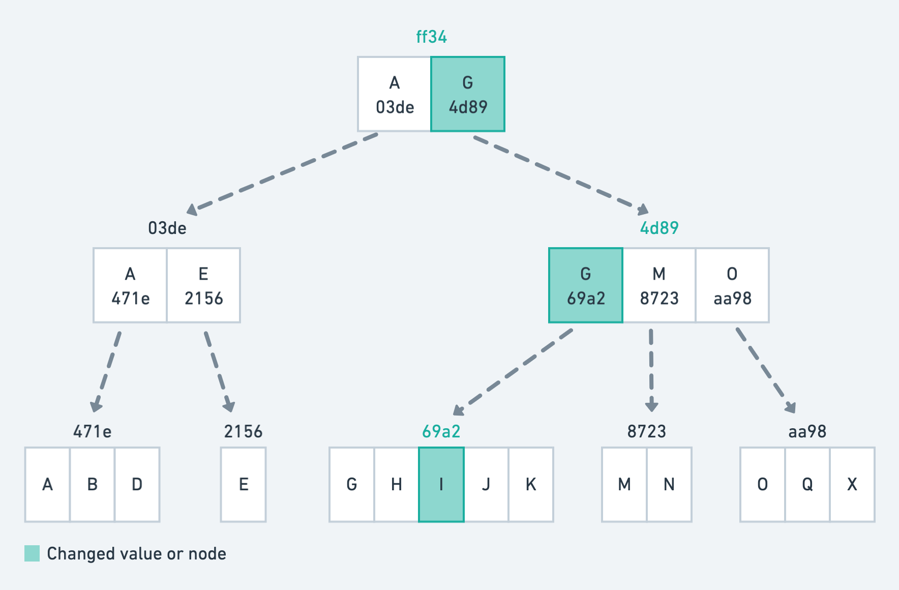

# Prolly Trees
Probabilistic Merkle B-Trees

## Problem
In order to have git-like diff, sync, and merge, you need merkle trees.

In order to have database-like features (joins, sorted scans) and performance, you need b-trees.

B-trees don’t “merklize” well because they are path-dependent - their topology is dependent on history of mutations.

## Prolly Trees
Probabilistic merkle b-trees

Like merkle trees:
* Verifiable
* Proofs of inclusion/exclusion
* Efficient and correct diff/sync/merge

Like b-trees:
* Efficient random reads/writes
* Efficient ordered scans
* Tightly controlled blocksize

B-trees are what enable databases to maintain large indexes efficiently.

Prolly-trees make indexes syncable and distributable on a p2p network.

## Prolly Tree Structure

* Prolly trees look like b trees - wide, shallow search trees
* Nodes have probabilistic capacity rather than min/max size
* Size of node is pure function of content
* Topology of tree is pure function of content
* Small changes in input yield small change in topology

## Prolly Tree construction for maps

* Slide a 64-byte window through serialized map
* At each offset compute hash over window
* If the 12 high bits are 1, last started item is boundary
* On average chunks will be 4kb (2^12)
* Repeat process recursively to form a tree
* Probability of any 1 bit change moving a boundary is about 65/4kb ~= 1.5%

## Prolly Tree mutation

* Conceptually, build new tree from scratch
* Memoize everything that can’t have changed
* Expected ops to write one change: 1.015*depth
* Can write a single change to a 4 level (281 TB) Prolly Tree with 4 4kb ops

## Some Properties of Prolly Trees

Prolly tree writes are slightly more expensive than b tree writes because there is a small (~1/64) chance of writing more than one node at each level.

Operation | B-Trees | Patricia Trees† / HAMTs | Prolly Trees
--------- | ------- | ----------------------- | ------------
1 Random Read | 🎉logk(n) | 🎉logk(n) | 🎉logk(n)
1 Random Write | 🎉logk(n) | 💩2*logk(n) | 👍(1+k/w)*logk(n)
Ordered scan of one item with size z | 🎉z/k | ❌ | 🎉z/k
Calculate diff of size d | 💩n | 🎉d | 🎉d
Verification, proofs | ❌ | 🙌 | 🙌
Structured sharing | ❌ | 🙌 | 🙌

**†** assuming hashed keys, unhashed destroys perf — **n**: total leaf data in tree, **k**: average block size, **w**: window width

